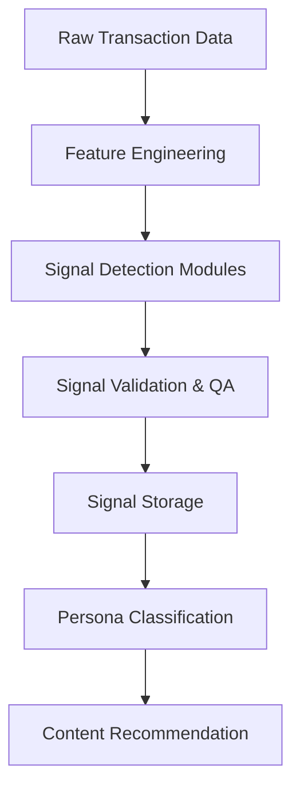

# SpendSense - System Architecture Guide

**Last Updated**: November 2025  
**Version**: 2.0 (Phase 4 Complete)

## 🎯 Purpose & Scope

This document provides the **technical architecture blueprint** for SpendSense, focusing on system design patterns, operational concerns, and architectural decisions not covered in the PRD or implementation guides.

**Companion Documents**:
- [PRD](misc/Reconstructed-PRD.md) - Business requirements and high-level architecture
- [Implementation Guides](misc/Implementation-Phase*.md) - Phase-by-phase implementation checklists
- [Operator Dashboard Guide](OPERATOR_DASHBOARD_GUIDE.md) - Complete dashboard usage guide

## 📐 Architecture Principles

### Core Design Principles
1. **Explainability First**: Every recommendation must have a clear "because" rationale
2. **Incremental Complexity**: Start simple, add sophistication iteratively
3. **Data Privacy by Design**: User consent and data minimization throughout
4. **Fail-Safe Operations**: Graceful degradation when components fail
5. **Audit Trail Everything**: Complete traceability of all decisions and data

### Technical Philosophy
- **Monolithic MVP**: Single deployable unit for faster iteration
- **Event-Driven Signals**: Clear separation between data ingestion and signal computation
- **Configuration-Driven Logic**: Business rules externalized for non-technical modification
- **Database-Centric**: SQLite as single source of truth with strong consistency
- **API-First UI**: All functionality exposed via REST API, consumed by Streamlit

---

## 🏗️ System Architecture Patterns

### 1. Data Flow Architecture

```
┌─────────────────┐    ┌──────────────────┐    ┌─────────────────────┐
│   Data Sources  │────▶│  Signal Pipeline │────▶│ Recommendation Flow │
└─────────────────┘    └──────────────────┘    └─────────────────────┘
        │                        │                         │
        ▼                        ▼                         ▼
┌─────────────────┐    ┌──────────────────┐    ┌─────────────────────┐
│ Synthetic Data  │    │ Behavioral       │    │ Content Matching &  │
│ Generation      │    │ Signal Detection │    │ Persona Assignment  │
└─────────────────┘    └──────────────────┘    └─────────────────────┘
```

#### Data Ingestion Strategy
- **Batch Processing**: CSV-based synthetic data for MVP
- **Event Sourcing Ready**: Transaction table structure supports real-time streaming
- **Immutable Append**: All raw data preserved for reprocessing and auditing
- **Schema Evolution**: JSON columns allow signal schema changes without migrations

#### Signal Computation Pipeline


**Key Patterns**:
- **Modular Signal Detection**: Each signal type (credit, income, savings, subscriptions) in separate modules
- **Schema-First Validation**: Pydantic models ensure consistent signal output format
- **Temporal Windows**: Multiple time windows (30d, 180d) for different signal types
- **Quality Scoring**: Data quality metrics propagated through entire pipeline

### 2. Recommendation Engine Architecture

#### Content Matching Strategy
```
User Signals → Signal Triggers → Content Filters → Scoring → Ranking → Rationale Generation
```

**Multi-Stage Filtering**:
1. **Eligibility Filter**: Remove content user can't access (income, credit score, existing products)
2. **Persona Filter**: Match user's assigned persona to content persona tags
3. **Signal Filter**: Match behavioral signals to content trigger requirements
4. **Recency Filter**: Prevent recommending recently shown content (30-day window)
5. **Business Filter**: Apply partner offer caps and educational content minimums

#### Scoring Algorithm Design
```python
# Simplified scoring formula
final_score = (
    persona_match_score * 0.4 +
    signal_match_score * 0.3 + 
    content_priority_score * 0.2 +
    freshness_score * 0.1
)
```

**Explainability Architecture**:
- **Rationale Templates**: Pre-written explanation templates per content type
- **Signal Context**: Specific user signal values embedded in rationales
- **Transparency Tokens**: Machine-readable codes for explanation tracing

### 3. Guardrails Architecture

#### Multi-Layer Protection
```
Request → Consent Check → Eligibility Validation → Tone Enforcement → Content Delivery
```

**Consent Management**:
- **Database-Enforced**: Foreign key constraints prevent recommendations to non-consented users
- **API-Level Checks**: Double validation at recommendation generation
- **Audit Logging**: All consent decisions logged with timestamps

**Content Safety**:
- **Prohibited Pattern Detection**: Regex-based scanning for financial shaming language
- **Positive Framing Enforcement**: Automatic rewriting of negative language
- **Disclaimer Injection**: Required disclaimers automatically appended

---

## 🔧 Component Architecture

### 1. Database Design Patterns

#### Entity Relationship Architecture
```sql
users (1) ←→ (N) accounts (1) ←→ (N) transactions
users (1) ←→ (N) user_signals
users (1) ←→ (N) recommendations
accounts (1) ←→ (1) liabilities
recommendations (N) ←→ (1) content_catalog
```

**Key Design Decisions**:
- **Denormalized Signals**: JSON storage for flexibility vs. performance trade-off
- **Immutable Recommendations**: Never update, only append new recommendations
- **Temporal Partitioning**: Signals partitioned by time window for efficient querying
- **WAL Mode**: Write-Ahead Logging for concurrent read/write access

#### Data Consistency Patterns
- **Transactional Boundaries**: Signal computation and recommendation generation in single transactions
- **Retry Logic**: Automatic retry with exponential backoff for database locks
- **Graceful Degradation**: Read-only fallbacks when database is locked
- **Integrity Constraints**: Foreign keys enforce referential integrity

### 2. API Architecture Patterns

#### API Endpoint Architecture (Phase 4 Complete)
The SpendSense API provides 10+ endpoints organized by functionality:

**Core Endpoints**:
- `GET /` - API information and version
- `GET /health` - System health check
- `GET /profile/{user_id}` - User profile with persona and signals
- `GET /recommendations/{user_id}` - Personalized recommendations

**User Management Endpoints**:
- `POST /users` - Create new user (Phase 4B)
- `POST /consent` - Update user consent status (Phase 4B)

**Recommendation Actions**:
- `POST /recommendations/{rec_id}/approve` - Approve/reject recommendation (Phase 4B)
- `GET /recommendations/{rec_id}/view` - Mark recommendation as viewed (Phase 4B)
- `POST /feedback` - Record user feedback on recommendations

**Operator Endpoints**:
- `GET /operator/review` - Get recommendations pending review

#### Standardized Response Format
```json
{
  "status": "success|error", 
  "data": { /* actual response */ },
  "message": "human readable status",
  "timestamp": "ISO 8601 timestamp",
  "request_id": "unique request identifier"
}
```

**Error Handling Strategy**:
- **Structured Exceptions**: Custom exception hierarchy with error codes
- **Context Preservation**: Full error context without sensitive data exposure
- **Circuit Breaker**: Fail-fast patterns for external dependencies
- **Graceful Fallbacks**: Default responses when components unavailable

#### Authentication & Authorization
```
Client → API Gateway → JWT Validation → Role-Based Access → Resource Access
```

**Security Patterns**:
- **Operator-Only API**: No end-user facing API in MVP (end-users use Streamlit UI)
- **Role-Based Permissions**: Admin, Operator, Read-Only roles (future)
- **Rate Limiting**: Per-endpoint and per-IP rate limiting (future)
- **Audit Logging**: All API calls logged with user context

### 3. Content Management Architecture

#### Configuration-Driven Content
```
YAML Config → JSON Validation → Runtime Loading → Cache Layer → API Serving
```

**Content Lifecycle**:
- **Version Control**: All content changes tracked with version numbers
- **A/B Testing Ready**: Content variants supported in schema
- **Hot Reloading**: Configuration changes without application restart
- **Validation Pipeline**: Schema validation prevents malformed content deployment

### 4. User Interface Architecture (Phase 4)

#### Dual-Interface Design Pattern
SpendSense implements a **dual-interface architecture** separating operator and end-user experiences:

```
┌─────────────────────────────────────────────────────────────┐
│                    Streamlit Application                      │
│  ┌──────────────────────┐      ┌──────────────────────┐   │
│  │  Operator Dashboard  │      │   End-User View       │   │
│  │  (Internal Tool)     │      │   (Public-Facing)     │   │
│  └──────────────────────┘      └──────────────────────┘   │
│           │                              │                  │
│           └──────────────┬────────────────┘                  │
│                          │                                   │
│                  ┌───────▼────────┐                          │
│                  │  Shared API    │                          │
│                  │  Layer (FastAPI)│                          │
│                  └────────────────┘                          │
└─────────────────────────────────────────────────────────────┘
```

#### Operator Dashboard Architecture (Phase 4 Complete)
**6-Page Dashboard Structure**:

1. **System Overview**: Health metrics, system status, key KPIs
2. **User Analytics**: Persona distribution, signal insights, user details
3. **Recommendation Engine**: Recommendation review, approval queue, content performance
4. **Data Quality**: Quality score distribution, missing data analysis, freshness metrics
5. **Performance Metrics**: P95 compute time, error rates, fairness metrics, relevance metrics
6. **System Logs**: Real-time log streaming, error tracking, activity monitoring

**Architecture Patterns**:
- **Page-Based Routing**: Streamlit multi-page app pattern
- **Shared State Management**: Session state for user preferences and filters
- **Auto-Refresh**: Configurable 30-second refresh for real-time monitoring
- **Database Path Configuration**: Runtime database path configuration for flexibility

#### End-User Interface Architecture (Phase 4A)
**User View Page** (`src/ui/pages/user_view.py`):

**Design Principles**:
- **User-Friendly Language**: Plain English explanations, no technical jargon
- **Visual Persona Cards**: Icon-based persona representation with clear descriptions
- **Recommendation Cards**: Clear, actionable recommendation display
- **Rationale Prominence**: "Why this matters" section prominently displayed

**Data Flow**:
```
User ID Input → Database Query → Persona Classification → 
Recommendation Retrieval → Rationale Formatting → UI Rendering
```

**Key Features**:
- **Persona Display**: Shows assigned persona with matched criteria
- **Recommendation List**: 3-5 personalized recommendations with rationales
- **Content Metadata**: Reading time, content type, "Learn More" links
- **Error Handling**: Graceful handling of missing users or data

---

## 🚀 Deployment Architecture

### MVP Deployment Pattern
```
┌─────────────────────────────────────────────────────────────┐
│                    Single Server Deployment                  │
│  ┌─────────────┐  ┌──────────────┐  ┌─────────────────────┐  │
│  │   Streamlit │  │   FastAPI    │  │      SQLite         │  │
│  │      UI     │  │     API      │  │     Database        │  │
│  │   :8501     │  │    :8000     │  │   spend_sense.db    │  │
│  └─────────────┘  └──────────────┘  └─────────────────────┘  │
│         │                 │                     │            │
│         └─────────────────┼─────────────────────┘            │
│                           │                                  │
│  ┌─────────────────────────────────────────────────────────┐  │
│  │              Shared File System                         │  │
│  │   • Database files                                      │  │
│  │   • Content catalog                                     │  │
│  │   • Configuration files                                 │  │
│  │   • Log files                                           │  │
│  └─────────────────────────────────────────────────────────┘  │
└─────────────────────────────────────────────────────────────┘
```

**Deployment Strategy**:
- **Single Binary**: All components in one deployable unit
- **File-Based Configuration**: YAML/JSON config files for business logic
- **Local File Storage**: No external dependencies for MVP
- **Process Management**: Systemd or Docker Compose for service management

### Production Scaling Architecture
```
┌──────────────┐    ┌─────────────────┐    ┌──────────────────┐
│ Load Balancer│────│   API Gateway   │────│  Service Mesh    │
└──────────────┘    └─────────────────┘    └──────────────────┘
                            │                        │
        ┌───────────────────┼────────────────────────┼───────────┐
        │                   │                        │           │
   ┌────▼────┐         ┌────▼────┐              ┌────▼────┐      │
   │ UI Layer│         │API Layer│              │Data Layer│     │
   │(Multiple│         │(Multiple│              │         │     │
   │Instances)│         │Instances)│              │PostgreSQL│     │
   └─────────┘         └─────────┘              │Cluster   │     │
                                                └─────────┘     │
                                                                │
   ┌─────────────────────────────────────────────────────────────┘
   │
   ▼
┌──────────────────────────────────────────────────────────────┐
│                   Monitoring & Observability                 │
│  ┌─────────────┐ ┌─────────────┐ ┌─────────────────────────┐ │
│  │    Logs     │ │   Metrics   │ │       Distributed       │ │
│  │(Structured) │ │(Prometheus) │ │       Tracing           │ │
│  └─────────────┘ └─────────────┘ └─────────────────────────┘ │
└──────────────────────────────────────────────────────────────┘
```

---

## 📊 Performance & Scalability Architecture

### Bottleneck Analysis & Mitigation

#### Database Performance Patterns
**Identified Bottlenecks**:
1. **Signal Computation**: Complex JOIN queries across large transaction sets
2. **Recommendation Generation**: Content catalog filtering and scoring
3. **Concurrent Access**: Multiple operators accessing dashboard simultaneously

**Optimization Strategies**:
```sql
-- Indexed query patterns
CREATE INDEX idx_transactions_user_date ON transactions(user_id, date);
CREATE INDEX idx_user_signals_window ON user_signals(user_id, window);
CREATE INDEX idx_recommendations_user_created ON recommendations(user_id, created_at);

-- Query optimization patterns
-- Use covering indexes for common queries
-- Partition large tables by time periods
-- Pre-compute expensive aggregations
```

#### Caching Architecture
```
┌─────────────┐    ┌──────────────┐    ┌─────────────────┐
│ Application │────│  Cache Layer │────│    Database     │
│   Layer     │    │  (In-Memory) │    │   (SQLite)      │
└─────────────┘    └──────────────┘    └─────────────────┘
                          │
                   Cache Strategies:
                   • User signals (TTL: 1hr)
                   • Content catalog (TTL: 24hr) 
                   • Computed recommendations (TTL: 30min)
```

#### Computational Scaling Patterns
- **Batch Processing**: Process users in batches to control memory usage
- **Parallel Signal Computation**: Independent signal modules run concurrently
- **Async Processing**: Non-blocking I/O for database operations
- **Result Streaming**: Stream large result sets rather than loading in memory

---

## 🔒 Security Architecture

### Data Privacy Design Patterns

#### Privacy-by-Design Architecture
```
Data Collection → Minimization → Purpose Limitation → Storage Limitation → Deletion
```

**Data Classification**:
- **PII (Personal)**: User IDs, account information (encrypted at rest)
- **Financial (Sensitive)**: Transaction amounts, balances (encrypted + access logs)  
- **Behavioral (Derived)**: Computed signals (pseudonymized, aggregated)
- **Content (Public)**: Recommendations, educational content (standard protection)

#### Access Control Matrix
| Role | User Data | Financial Data | Signals | Content | System Config |
|------|-----------|----------------|---------|---------|---------------|
| Admin | ✅ Full | ✅ Full | ✅ Full | ✅ Full | ✅ Full |
| Operator | ❌ None | ❌ Aggregated Only | ✅ Read | ✅ Read/Write | ❌ Read Only |
| Analyst | ❌ None | ❌ None | ✅ Aggregated | ✅ Read | ❌ None |

### Application Security Patterns

#### Input Validation Architecture
```python
# Multi-layer validation pattern
Request → Schema Validation → Business Rule Validation → Database Constraints
```

**Security Controls**:
- **SQL Injection Prevention**: Parameterized queries throughout
- **XSS Protection**: Content Security Policy headers, input sanitization
- **CSRF Protection**: Token-based request validation
- **Rate Limiting**: Adaptive rate limiting based on endpoint sensitivity
- **Audit Logging**: Immutable audit trail for all data access

---

## 📈 Monitoring & Observability Architecture

### Telemetry Collection Strategy

#### Three Pillars of Observability
```
┌─────────────┐    ┌─────────────┐    ┌─────────────────┐
│    Logs     │    │   Metrics   │    │     Traces      │
│ (Structured)│    │ (Business & │    │  (Request Flow) │
│             │    │  Technical) │    │                 │
└─────────────┘    └─────────────┘    └─────────────────┘
       │                   │                     │
       └───────────────────┼─────────────────────┘
                           │
              ┌─────────────▼─────────────┐
              │   Observability Platform  │
              │   • Correlation Engine    │
              │   • Alerting Rules        │
              │   • Dashboard Generation  │
              │   • Incident Response     │
              └───────────────────────────┘
```

#### Business Metrics Architecture
```python
# Key business metrics tracked
METRICS = {
    "user_coverage_rate": "% of users receiving recommendations",
    "recommendation_click_rate": "% of recommendations acted upon", 
    "persona_distribution": "Distribution across persona types",
    "content_effectiveness": "Performance by content type",
    "system_reliability": "Uptime and error rates",
    "data_quality_trends": "Signal quality over time"
}
```

#### Fairness Metrics Architecture (Phase 4C)
**Demographic Parity Framework**:

```python
# Fairness metrics calculation pattern
def calculate_fairness_metrics():
    # 1. Check for demographic data availability
    # 2. Calculate recommendation rates by demographic group
    # 3. Compute parity metric (coefficient of variation)
    # 4. Flag disparities (>10% difference from average)
    # 5. Return framework if demographics not available
```

**Key Metrics**:
- **Recommendation Rate by Group**: % of users receiving recommendations per demographic
- **Parity Metric (CV)**: Coefficient of variation across groups (lower = better)
- **Disparity Detection**: Flags groups with >10% difference from average
- **Parity Status**: "good" (CV < 10%) or "needs_review" (CV >= 10%)

**Architecture Pattern**:
- **Schema Detection**: Automatically detects demographic columns in users table
- **Graceful Degradation**: Returns framework when demographics unavailable
- **Future-Ready**: Framework ready for when demographic data is added

#### Relevance Metrics Architecture (Phase 4B)
**Content-Persona Fit Scoring**:

```python
# Relevance calculation pattern
def calculate_relevance_score(content, persona_id, triggers):
    # 1. Persona match score (content.personas contains persona_id)
    # 2. Trigger match score (content.triggers overlaps with user triggers)
    # 3. Priority score (content.priority_score, capped at 10.0)
    # 4. Combined relevance score (0.0-1.0)
```

**Aggregate Relevance Metrics**:
- **Average Relevance**: Mean relevance score across all recommendations
- **High Relevance Count**: Recommendations with relevance >= 0.7
- **Low Relevance Count**: Recommendations with relevance < 0.5
- **Relevance Distribution**: Breakdown by high/medium/low buckets

**Architecture Pattern**:
- **Per-Recommendation Scoring**: Individual relevance for each recommendation
- **Aggregate Analysis**: System-wide relevance metrics
- **Content-Persona Alignment**: Ensures recommendations match persona focus areas

### Alerting & Incident Response
- **Threshold-Based Alerts**: System health metrics (error rates, response times)
- **Anomaly Detection**: Unusual patterns in user behavior or system performance
- **Business Rule Violations**: Guardrails breaches, compliance issues
- **Escalation Policies**: Automated escalation based on alert severity
- **Runbook Automation**: Automated remediation for common issues

---

## 🔮 Future Architecture Considerations

### Extensibility Patterns

#### Plugin Architecture for Signal Detection
```python
# Future signal plugin interface
class SignalDetectorPlugin:
    def detect_signals(self, user_id: str, transactions: DataFrame) -> Dict[str, Any]:
        pass
    
    def get_schema(self) -> Dict[str, Any]:
        pass
```

#### Content Management Evolution
- **Headless CMS Integration**: Decouple content storage from application
- **Dynamic Content Generation**: AI-generated personalized content
- **Multi-Channel Delivery**: Email, SMS, push notifications
- **Localization Support**: Multi-language content management

### Scalability Migration Paths

#### Database Evolution Strategy
```
SQLite (MVP) → PostgreSQL (Scale) → Event Sourcing (Enterprise)
```

**Migration Considerations**:
- **Schema Migration Tools**: Automated migration scripts with rollback capability
- **Data Pipeline Evolution**: Batch → Streaming → Real-time event processing
- **API Versioning**: Backward-compatible API evolution strategy
- **Service Decomposition**: Monolith → Microservices migration path

#### Integration Architecture
- **Event-Driven Architecture**: Pub/sub patterns for service communication
- **API Gateway Evolution**: Rate limiting, transformation, composition
- **Data Mesh Patterns**: Decentralized data ownership with standardized interfaces
- **MLOps Integration**: Model training, deployment, and monitoring pipelines

---

## 📋 Architecture Decision Records (ADRs)

### ADR-001: SQLite for MVP Database
**Decision**: Use SQLite as primary database for MVP
**Rationale**: Zero-ops deployment, ACID compliance, sufficient performance for <1000 users
**Trade-offs**: Limited concurrent writes, single-server deployment
**Migration Path**: PostgreSQL when concurrent users >100

### ADR-002: Monolithic Deployment for MVP  
**Decision**: Single deployable unit containing all components
**Rationale**: Faster development, simpler deployment, reduced operational overhead
**Trade-offs**: Scaling limitations, single point of failure
**Migration Path**: Service extraction based on performance bottlenecks

### ADR-003: Configuration-Driven Personas
**Decision**: YAML-based persona definitions with runtime loading
**Rationale**: Non-technical users can modify business logic, A/B testing support
**Trade-offs**: Configuration complexity, runtime validation overhead
**Benefits**: Rapid iteration, reduced deployment frequency

### ADR-004: JSON Signal Storage
**Decision**: Store computed signals as JSON in database
**Rationale**: Schema flexibility, faster development, easier debugging
**Trade-offs**: Query performance, data type enforcement
**Migration Path**: Normalize to structured tables when query patterns stabilize

### ADR-005: Streamlit for Operator UI
**Decision**: Use Streamlit for internal operator dashboard
**Rationale**: Rapid development, Python-native, good for data visualization
**Trade-offs**: Limited customization, single-user performance
**Migration Path**: React/Vue.js SPA when UI complexity increases

### ADR-006: Dual-Interface Architecture (Phase 4A)
**Decision**: Separate operator dashboard and end-user view within single Streamlit app
**Rationale**: Code reuse, shared API layer, faster development, single deployment
**Trade-offs**: Both interfaces in same application, potential performance impact
**Benefits**: Unified codebase, shared components, easier maintenance

### ADR-007: Fairness Metrics Framework (Phase 4C)
**Decision**: Implement fairness metrics framework with graceful degradation
**Rationale**: Future-ready for demographic data, demonstrates ethical AI commitment
**Trade-offs**: Framework returns placeholder when demographics unavailable
**Migration Path**: Automatic activation when demographic columns added to users table

### ADR-008: Relevance Metrics for Content-Persona Fit (Phase 4B)
**Decision**: Calculate relevance scores based on content-persona alignment
**Rationale**: Ensures recommendations match persona focus areas, improves quality
**Trade-offs**: Additional computation overhead, requires content catalog metadata
**Benefits**: Measurable recommendation quality, content-persona alignment tracking

---

## 🎯 Implementation Roadmap Alignment

This architecture guide aligns with the phased implementation approach:

**Phase 1 (Data Foundation)**: Implements core data flow patterns and signal computation architecture
**Phase 2 (Recommendations)**: Implements content management and recommendation engine patterns  
**Phase 3 (Operations)**: Implements monitoring, evaluation, and operational patterns
**Phase 4 (Complete MVP)**: Implements end-user interface, complete API endpoints, fairness/relevance metrics, and full operator dashboard

### Phase 4 Architectural Additions

**Phase 4A (Critical Path)**:
- End-user interface architecture (User View page)
- 5th custom persona (Fee Fighter) with configurable criteria
- Dual-interface Streamlit architecture pattern

**Phase 4B (Complete Original Spec)**:
- Complete API endpoint architecture (10+ endpoints)
- Relevance metrics architecture (content-persona fit scoring)
- Full operator dashboard (6 pages)

**Phase 4C (Submission Polish)**:
- Fairness metrics architecture (demographic parity framework)
- Comprehensive evaluation metrics integration
- Production-ready monitoring patterns

Each architectural pattern is designed to support the incremental complexity approach while maintaining clear migration paths for future scaling needs.

The architecture balances **simplicity for MVP delivery** with **extensibility for future growth**, ensuring the system can evolve from a proof-of-concept to a production-scale platform.
